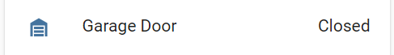

# ESPHome Two-Pin Garage Sensor
The Two-pin garage door sensor uses two GPIO pins to detect when the door is in the upper-most ("Open") position, and the bottom-most ("Closed") position. Using knowledge of the previous state, it's able to determine when the door is "Opening" or "Closing", which both occur when neither pin is high. A simple reed sensor is typically used for the top and bottom sensors.



```yaml
# Example configuration entry
text_sensor:
  - platform: two_pin_garage
    name: Garage Door
    debounce: "1s"
    top_pin:
      number: D2
      inverted: True
      mode: INPUT_PULLUP
    bottom_pin:
      number: D3
      inverted: True
      mode: INPUT_PULLUP
```

## Configuration variables:
 * **top_pin** (**Required**, [Pin Schema](https://esphome.io/guides/configuration-types.html#config-pin-schema): The input pin attached to the top sensor
 * **bottom_pin** (**Required**, [Pin Schema](https://esphome.io/guides/configuration-types.html#config-pin-schema)): The input pin attached to the bottom sensor
 * **debounce** (*Optional*, [Time](https://esphome.io/guides/configuration-types.html#config-time)): The duration to debounce both sensors. Defaults to `250ms`.
 * All other options from [Text Sensor](https://esphome.io/components/text_sensor/index.html#base-text-sensor-configuration).

 Advanced options:
  * **id** (*Optional*, [ID](https://esphome.io/guides/configuration-types.html#config-id)): Manually specify the ID used for code generation.

## Installation
Make a folder in your `esphome` folder called `custom_components` if one doesn't already exist. Then, put the `two_pin_garage` folder in the `custom_components` folder.